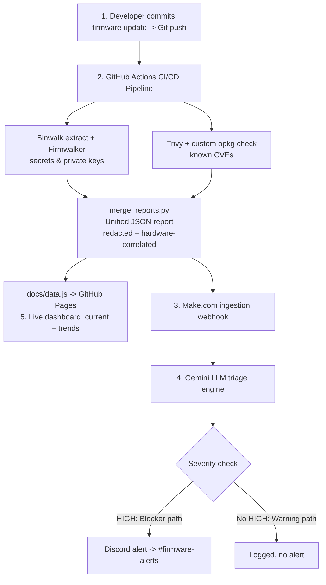

# 🛡️ Shift-Left Firmware SecOps Pipeline

An automated CI/CD pipeline that intercepts a firmware build on every push, extracts its filesystem, statically scans it for hardcoded credentials, private keys, and known CVEs, correlates each finding to a physical hardware attack, and uses an AI triage engine to deliver plain-English alerts and a live dashboard — instead of dumping raw logs after a device has already shipped.

**Live dashboard:** https://khyathi96.github.io/Shift-left-firmware-pipeline/

---

## Problem Statement

Firmware is typically shipped as a compiled binary "black box" that standard application security scanners cannot inspect. Vulnerabilities like plaintext credentials, expired certificates, and outdated components are usually caught only by late-stage manual audits — sometimes after the device has shipped, when fixes mean costly recalls or risky over-the-air updates.

This project *shifts security left*: scanning happens automatically at commit time, and findings arrive as plain-English triage summaries — each mapped to its real-world physical exploitation risk — rather than raw logs at the end of the product cycle.

---

## Solution Overview

On every push, the pipeline:

1. Extracts the firmware filesystem.
2. Runs three complementary scanners (secrets, CVEs, and a custom OpenWrt package check).
3. Merges the results into one redacted, schema-consistent JSON report.
4. Enriches every finding with a hardware attack-surface correlation.
5. Routes high-severity reports through an LLM that writes a triage alert.
6. Delivers alerts to Discord and publishes a self-updating security dashboard.

All of this runs with zero manual steps, the moment code is pushed.

---

## Architecture & Build Sequence

The project was built in five stages, each owned by a team member, that together
form the end-to-end pipeline:

```
1. FIRMWARE ARTIFACT            2. HARDWARE CONSTRAINTS
   (Seetha)                        (Aishwarya)
   Mock squashfs image with        Hardware threat model +
   planted vulnerabilities         software-to-hardware
        │                          correlation rules (v2.0.0)
        │                                 │
        └───────────────┬─────────────────┘
                        ▼
        3. GITHUB REPOSITORY + CI/CD  (Khyathi)
           Git push ──> GitHub Actions:
             Binwalk extract ──> Firmwalker (secrets/keys)
                             ──> Trivy + custom opkg check (CVEs)
                             ──> merge_reports.py
                                  (unified, redacted, hardware-correlated JSON)
                             ──> POST via webhook ─┐
                        │                          │
       ┌────────────────┘                          ▼
       ▼                              4. MAKE SCENARIO  (Rashmi)
  5. DASHBOARD  (Khyathi)               Webhook ──> Router (Blocker/Warning)
     docs/data.js regenerated ──>               ──> Gemini LLM triage
     GitHub Pages (current + trends)            ──> Discord alert
```

**Stage sequence:**
1. **Firmware artifact creation** — a mock firmware image is built with deliberately planted vulnerabilities (Seetha).
2. **Hardware constraints** — a hardware threat model and software-to-hardware correlation rules are defined (Aishwarya).
3. **Repository & CI/CD** — the GitHub repo and Actions pipeline consume both of the above, scan the firmware on every push, and pass the unified report to Make.com via webhook (Khyathi).
4. **Make scenario** — the report is routed, classified by the Gemini LLM, and an alert is triggered to Discord (Rashmi).
5. **Dashboard** — a self-updating dashboard is generated and deployed to GitHub Pages (Khyathi).

### End-to-End Flow (as built)



A higher-level design/topology diagram is also available at `docs/systems_topology.png`.

---

## Tech Stack

| Layer | Tool |
|---|---|
| CI/CD | GitHub Actions (Ubuntu runner) |
| Firmware extraction | Binwalk + squashfs-tools |
| Secret / key scanning | Firmwalker |
| CVE scanning | Trivy + custom opkg checker |
| Report merge & correlation | Python |
| Workflow automation | Make.com |
| AI triage | Google Gemini (Flash) |
| Alerting | Discord |
| Dashboard | Static HTML + Chart.js on GitHub Pages |

---

## Repository Structure

```
firmware/            Mock vulnerable firmware artifact (squashfs)
scripts/             Extraction, scanning, merge, and dashboard scripts
.github/workflows/   CI pipeline definition (firmware-scan.yaml)
docs/                Dashboard (index.html, data.js), system topology diagram
automation/          Make.com scenario blueprint (importable)
hardware_risk_rules.json   Software-to-hardware correlation rules (v2.0.0)
```

---

## How the Pipeline Works

Every push to `main` (and every pull request) triggers `.github/workflows/firmware-scan.yaml` on a fresh Ubuntu runner:

1. **Checkout & locate firmware** — finds the artifact in `firmware/` by extension; fails loudly if none is present.
2. **Extract** — installs Binwalk + squashfs-tools and unpacks the firmware filesystem.
3. **Firmwalker scan** — searches the filesystem for hardcoded credentials, private keys, and certificates.
4. **Trivy CVE scan** — scans for known CVEs in recognised packages.
5. **Custom opkg CVE check** (`scripts/opkg_cve_check.sh`) — parses the OpenWrt `opkg` package database (unsupported by Trivy) and matches installed versions against known-vulnerable ones (e.g. BusyBox 1.19.4).
6. **Merge & correlate** (`scripts/merge_reports.py`) — normalises all three scanners into `unified_report.json`, assigns severities, redacts secret values, and attaches hardware attack-surface context from `hardware_risk_rules.json`.
7. **Dashboard data** (`scripts/build_dashboard_data.py`) — regenerates `docs/data.js` and appends the run to the trend history (committed back with `[skip ci]` to avoid retriggering).
8. **Deliver** — uploads reports as artifacts and POSTs `unified_report.json` to the Make.com triage webhook.

---

## Unified Report & Redaction

All scanner outputs are normalised into a single schema so downstream consumers (Make.com, the dashboard) never parse three different formats. Each finding carries: `id`, `source`, `type`, `severity`, `file`, `identifier`, `description`, `hardware_context`, and `redacted`.

**Security by design:** secret *values* are stripped before anything leaves the runner. Reports, alerts, and the public dashboard contain finding metadata only — never the actual credential, key, or token.

---

## Hardware Correlation (v2.0.0)

Each software finding is mapped to a physical hardware attack surface via `hardware_risk_rules.json`. The rule set (schema v2.0.0) defines five attack surfaces, each with the access level required and the simulated exposure vector:

| Rule | Attack Surface | Correlated Finding Type |
|---|---|---|
| HW-RULE-001 | External SPI Flash Memory Chip | Plaintext credentials / private keys |
| HW-RULE-002 | UART Serial Test Pads | Exposed console / terminal service |
| HW-RULE-003 | JTAG Debug Interface | Direct memory / register access |
| HW-RULE-004 | USB / External Expansion Ports | Unsigned firmware update (DFU) |
| HW-RULE-005 | System SoC / Cryptographic Coprocessor | Outdated packages with known CVEs |

The correlation is applied in the pipeline's merge step and surfaced through the AI triage engine, so each Discord alert explains not just the software flaw but how it could be physically exploited on the device.

---

## AI Triage Workflow (Make.com)

The Make.com scenario receives the report via webhook and:

1. **Router** splits traffic into a *Blocker* path (any HIGH finding) and a *Warning* path.
2. **Transform to JSON** serialises the report for the LLM.
3. **Google Gemini** acts as an L3 SOC analyst, writing a markdown triage alert: executive summary, critical findings with real-world impact, remediation steps, and a physical-risk section derived from the hardware correlation.
4. **Discord** posts the formatted alert to `#firmware-alerts`.

### Importing the Make.com scenario
The full scenario is exported as a blueprint at
`automation/make_scenario.blueprint.json`. To reuse it:

1. In Make.com, create a new scenario → **Import Blueprint** → select the file.
2. **Reconnect the Gemini connection** — connections are not exported, so add
   your own Google Gemini API key on import.
3. **Set the Discord webhook URL** in the HTTP module — it is redacted in the
   blueprint (`REDACTED_DISCORD_WEBHOOK_URL`) and must be replaced with a live
   channel webhook.
4. Copy the scenario's intake webhook URL into the `MAKE_WEBHOOK_URL` GitHub
   secret so the pipeline can reach it.

> All webhook URLs and API keys are redacted from the committed blueprint by
> design — no live secrets are stored in the repository.

---

## Live Dashboard

A self-contained HTML dashboard, published via GitHub Pages, reads the pipeline-generated `docs/data.js`:

- **Current tab:** KPI cards, a severity breakdown chart, and a findings table including each finding's physical risk.
- **Trends tab:** vulnerabilities over time across runs, so remediation progress is visible.

The dashboard updates itself: every push regenerates the data and redeploys within a minute. It is public but leaks nothing — finding metadata only.

**URL:** https://khyathi96.github.io/Shift-left-firmware-pipeline/

---

## How to Run

### Prerequisites
- A GitHub repository with Actions enabled.
- A Make.com scenario with a Custom Webhook.
- One repository secret: `MAKE_WEBHOOK_URL` (Settings → Secrets and variables → Actions).

### Trigger a scan
- **Automatically:** push a commit to `main`, or open a pull request.
- **Manually:** Actions tab → *Firmware Security Scan* → **Run workflow**.

### View results
- **Scan artifacts:** the run's summary page (Firmwalker, Trivy, opkg, unified report).
- **Live dashboard:** https://khyathi96.github.io/Shift-left-firmware-pipeline/
- **Alerts:** the `#firmware-alerts` Discord channel.

### Update the firmware artifact
Commit the firmware image to `firmware/targets/`. The pipeline scans whatever is present there on the next push.

---

## Team & Contributions

| Member | Role | Contribution |
|---|---|---|
| Rashmi A S | Cybersecurity Threat Hunter | Security policy, Make.com triage routing, LLM alert design |
| G. Khyathi Sri | Automotive DevOps Engineer | Repository, GitHub Actions pipeline, scanner integration, unified report, dashboard, webhook delivery |
| Seetha Srikanth | Embedded Firmware Engineer | Mock vulnerable firmware artifact and documented planted flaws |
| Aishwarya Bhagat | Electrical Design Engineer | Hardware threat model, software-to-hardware correlation matrix, system topology diagram |

### 💼 Hardware Context & Threat Modeling — Aishwarya Bhagat
As the Electrical Design Engineer, I anchored the cross-functional pipeline by translating digital code vulnerabilities into real-world physical hardware risks, ensuring the compiled firmware was not treated as a generic software block.

- **Hardware Threat Modeling:** Formulated a lightweight physical threat matrix evaluating critical hardware entry points (UART Serial Test Pads, JTAG Debug Interfaces, External SPI Flash Chips, USB Expansion Ports, and the System SoC) against exploit proximity and firmware exposure profiles.
- **Cross-Domain Correlation:** Engineered the Software-to-Hardware Correlation Matrix (`hardware_risk_rules.json`), applied in the pipeline's merge step and surfaced through the AI triage engine, to map pipeline scanning signatures (such as plaintext credential leaks and outdated vulnerable binaries) directly to physical attack surfaces and their exposure vectors.
- **System Topology Architecture:** Designed and documented the complete end-to-end data ingestion and automated triage routing topology diagram.

---

## Future Enhancements

- AI-generated remediation code patches for detected findings.
- Live CVE lookup (retrieval-augmented) to replace the static opkg vulnerability list.
- Local/self-hosted LLM so no data leaves the environment.
- Automatic GitHub Issue creation for high-severity findings.
- Unsigned-firmware / secure-boot detection to activate hardware rule HW-RULE-004.
- Software Bill of Materials (SBOM) generation for compliance.
